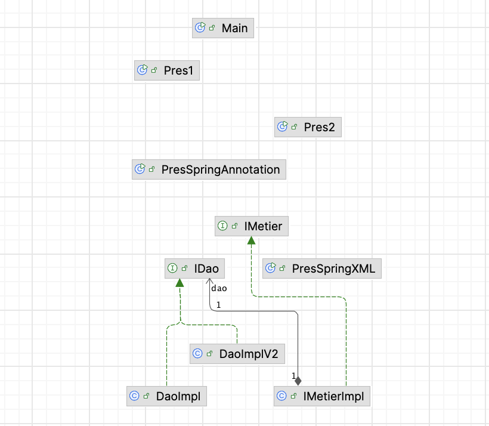
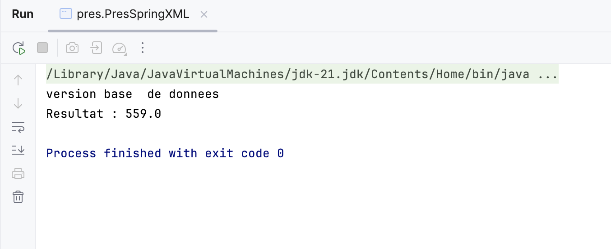
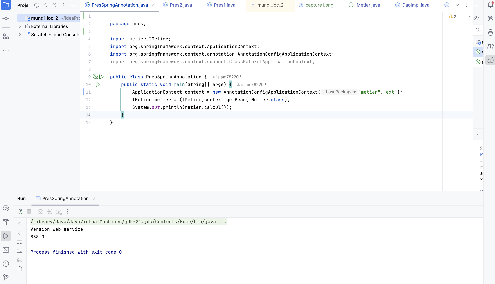
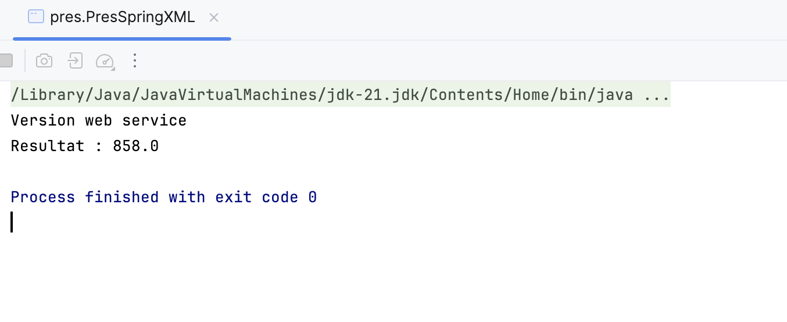
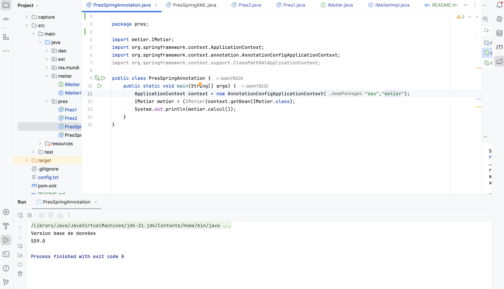
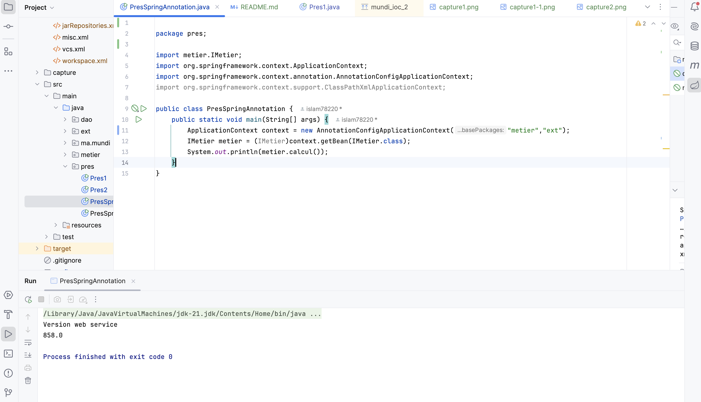

<h1>Rapport du TP : Injection des dépendenses</h1>
<h3> Diagramme de classe : </h3>

<h3>L'injection des dépendences - Version XML </h3>
<h4> Version base de données </h4>

<h4> Version web service </h4>

<h3>L'injection des dépendences - Version Annotation</h3>
<h4> Version base de données </h4>

<h4> Version web service </h4>

